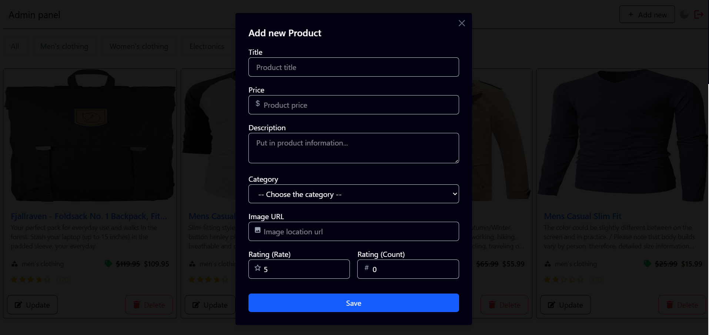
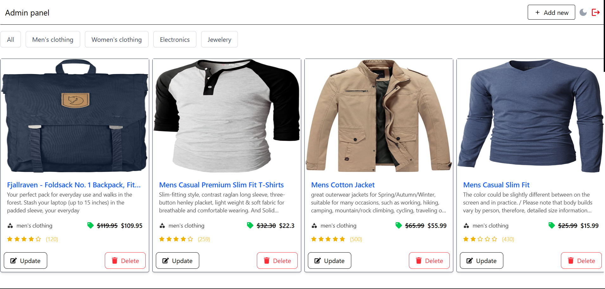
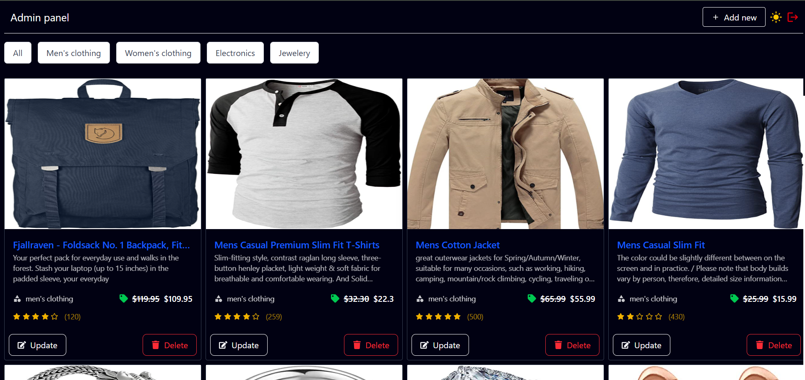

# 🛍️ Admin Panel — Product Management Dashboard

This project is a modern, responsive **Admin Panel** built with React.js for managing products. It allows you to add, delete, update products, and filter them by categories. The interface features attractive animations and optimized lazy loading for images.

---

## ✨ Features

- ✅ Add, delete, and update products
- 🔍 Filter products by four categories (Men's clothing, Women's clothing, Electronics, Jewelry)
- ⚡ Scroll-triggered animations using the `framer-motion` library
- 🖼️ Lazy loading of images to improve performance
- 💾 Product data is stored in `localStorage`
- 🧹 Automatically clears `localStorage` when the user leaves the site
- 📱 Fully responsive and modern design

---

## 🚀 Technologies Used

- React.js
- Tailwind CSS
- Framer Motion (for animations)
- Axios (for API requests)
- React Icons
- React Toastify (for notifications)

---

## 📂 Project Structure

_(You can add your project folder/file structure here)_

---

## 🖼️ UI Preview

| Add Modal | Light Mode Home Page | Dark Mode Home Page |
|-----------|---------------------|--------------------|
|  |  |  |

---

## 🧪 Running the Project Locally

```bash
# 1. Clone the repository
git clone https://github.com/your-username/admin-panel.git

# 2. Navigate into the project directory
cd admin-panel

# 3. Install dependencies
npm install

# 4. Start the development server
npm run dev